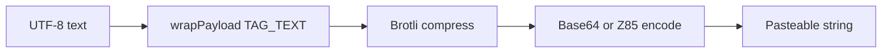
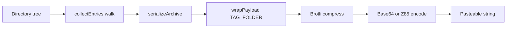
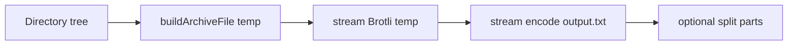
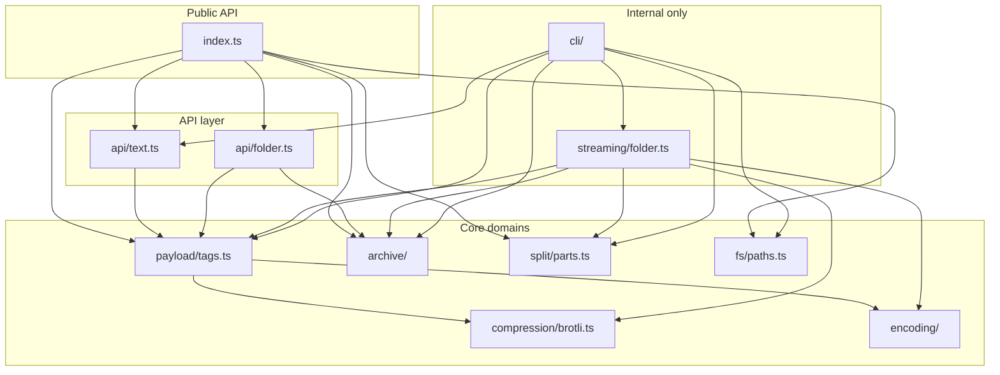

# Architecture Guide

This document explains how `text-compress` is structured, the algorithms it uses, and the design patterns behind each layer. It is written for developers who want to learn from or extend the codebase.

> **Package note:** v2 is published as [`text-compress`](https://www.npmjs.com/package/text-compress). v1 remains [`@startdoing/tc@1.0.4`](https://www.npmjs.com/package/@startdoing/tc).

## What this project does

The library turns **UTF-8 text** or **entire folder trees** into a single pasteable string (Base64 or Z85), and back again. The pipeline is:

```
Input → tag → Brotli (max quality) → Base64 or Z85 → pasteable string
```

Folder archives use a custom binary format before compression. Large outputs can be split into numbered part files for chat paste limits.

## Source layout (domain modules)

```
src/
├── index.ts                 # Public API barrel (npm package surface)
├── types.ts                 # Shared types (Encoding)
├── encoding/                # Base64 and Z85 text encodings
│   ├── base64.ts
│   ├── z85.ts
│   └── index.ts             # encodeBuffer / decodeBuffer facade
├── compression/
│   └── brotli.ts            # Brotli sync + streaming wrappers
├── payload/
│   └── tags.ts              # Type tags, wrap/decompress payload
├── archive/                 # Custom folder archive format
│   ├── types.ts
│   ├── format.ts            # Serialize / deserialize / stream writes
│   ├── collect.ts           # In-memory directory walk
│   └── unpack.ts            # Restore archive to disk
├── split/
│   └── parts.ts             # Split output into numbered files
├── fs/
│   └── paths.ts             # Path validation and file reading
├── api/
│   ├── text.ts              # compress() / decompress()
│   └── folder.ts            # compressFolder() / decompressToPath()
├── streaming/
│   └── folder.ts            # Large-folder pipeline (disk-backed)
└── cli/                     # Terminal interface
    ├── main.ts
    ├── args.ts
    ├── paths.ts
    ├── analytics.ts
    ├── output.ts
    ├── usage.ts
    └── commands/
        ├── compress.ts
        └── decompress.ts
```

Each file has a `@module` header comment describing its role, algorithms, and patterns.

## End-to-end data flow

### Text compression



### Folder compression (in-memory)



### Folder compression (streaming — CLI default for folders)



Peak memory stays bounded by chunk buffers (1–3 MiB), not total archive size.

## Applied mechanisms and patterns

### 1. Type tag (discriminated union)

After Brotli decompression, the **first byte** identifies the payload:

| Tag byte | Constant     | Meaning        |
|----------|--------------|----------------|
| `0x01`   | `TAG_TEXT`   | UTF-8 string   |
| `0x02`   | `TAG_FOLDER` | Binary archive |

This lets one encoded string represent either text or a folder without external metadata — similar to MIME types or protobuf field tags.

**Module:** `src/payload/tags.ts`

### 2. Strategy pattern (encoding selection)

`encodeBuffer(buffer, encoding)` and `decodeBuffer(str, encoding)` dispatch to Base64 or Z85 based on the `Encoding` type (`64 | 85`). Callers never branch on encoding elsewhere.

**Module:** `src/encoding/index.ts`

### 3. Brotli maximum-quality compression

We always use `BROTLI_MAX_QUALITY` (11) and `BROTLI_MAX_WINDOW_BITS` because the tool optimises for **smallest output**, not speed. `SIZE_HINT` is set to input length so the encoder can pre-allocate.

**Module:** `src/compression/brotli.ts`

### 4. Custom flat archive format

Instead of ZIP or tar, we use a minimal length-prefixed binary format:

```
directory: [0x44] [pathLen u32le] [path utf-8]
file:      [0x46] [pathLen u32le] [path] [contentLen u32le] [content]
```

Design choices:

- **Flat list** — produced by depth-first walk; easy to stream to disk.
- **Sorted children** — deterministic output for testing.
- **No metadata** — permissions and timestamps dropped for simplicity.
- **Path validation** — rejects `..` and absolute paths (zip-slip prevention).

**Modules:** `src/archive/format.ts`, `src/archive/collect.ts`, `src/archive/unpack.ts`

### 5. Z85 Base85 encoding

Z85 (ZeroMQ RFC 32) maps 4 bytes → 5 printable characters using a base-85 alphabet chosen to avoid quotes and backslashes. It is ~8% more compact than Base64.

Padding: a 1-byte prefix stores how many zero bytes were appended so arbitrary-length data round-trips.

**Module:** `src/encoding/z85.ts`

### 6. Split-file output

When encoded output exceeds 30,000 characters (or a user `-s` limit), it is split into numbered parts:

```
output.txt → output.1.txt, output.2.txt, …
```

Each logical part is prefixed with a `TCP\x02` header carrying `partIndex` and `totalParts`, so reassembly does not depend on filename order. A physical file may contain multiple consecutive parts, and adjacent part files can be merged into fewer files before decompress.

On decompress, pass any sibling file. All files whose basename starts with the same prefix (segment before the first `.`) are scanned; extension is ignored and invalid siblings are skipped.

Zero-padding width matches total part count on compress (filenames unchanged from v1).

**Module:** `src/split/parts.ts`

### 7. Staged streaming pipeline

For large folders, each stage writes to a temp file and the next stage reads from it:

```
walk → archive.bin → compressed.bin → output.txt
```

Pattern: **bounded memory via temp files** instead of loading everything into RAM.

**Module:** `src/streaming/folder.ts`

## Dependency graph



## Two folder compression paths

| Path | Function | When used | Memory |
|------|----------|-----------|--------|
| In-memory | `compressFolder()` | Library API, small folders | Loads all files into RAM |
| Streaming | `compressFolderToPath()` | CLI folder compress | Bounded by chunk buffers |

Both produce the same wire format; only the build strategy differs.

## Public vs internal modules

**Exported** via `src/index.ts` (published on npm):

- `compress`, `decompress`, `compressFolder`, `decompressToPath`
- `decompressPayload`, `TAG_TEXT`, `TAG_FOLDER`
- Split helpers, path helpers, `unpackDirectory`

**Internal** (not in package exports):

- `src/streaming/` — used by CLI only
- `src/cli/` — terminal interface
- `src/encoding/z85.ts` internals — use `encodeBuffer` instead

## Extending the codebase

| Goal | Where to start |
|------|----------------|
| New encoding (e.g. hex) | Add `encoding/hex.ts`, extend `Encoding` type and facade |
| Archive metadata (mtime) | Extend `ArchiveEntry` and wire format in `archive/format.ts` |
| Async text API | Mirror `api/text.ts` with async Brotli from `zlib/promises` |
| New payload type | Add tag constant in `payload/tags.ts`, route in decompress |

## Running and testing

```bash
npm install
npm test          # builds then runs Vitest
npm run build     # compile src/ → dist/
npm run check     # Biome lint + TypeScript
```

Tests import from `src/index.js` (library) and execute `dist/cli.js` (CLI integration).

## Further reading

- [LEARNING.md](./LEARNING.md) — glossary of concepts, patterns, and keywords with file references
- [Brotli format (RFC 7932)](https://www.rfc-editor.org/rfc/rfc7932)
- [Z85 specification (ZeroMQ RFC 32)](https://rfc.zeromq.org/spec/32/)
- [Base64 (RFC 4648)](https://www.rfc-editor.org/rfc/rfc4648)
